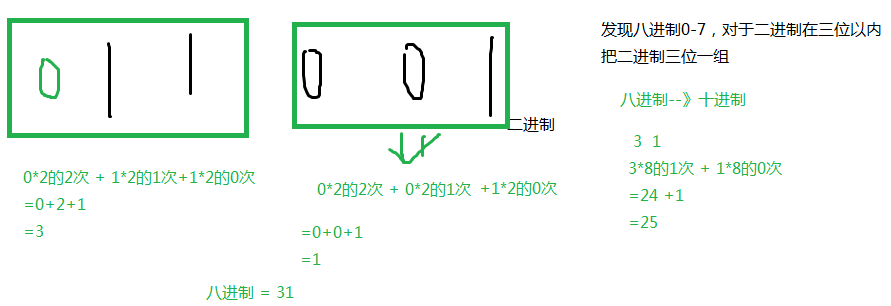
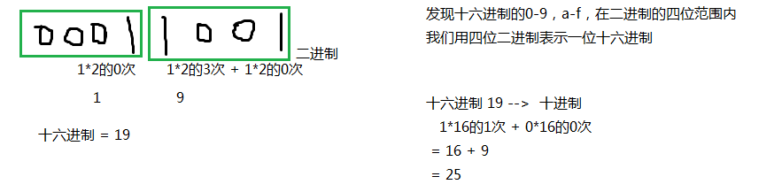
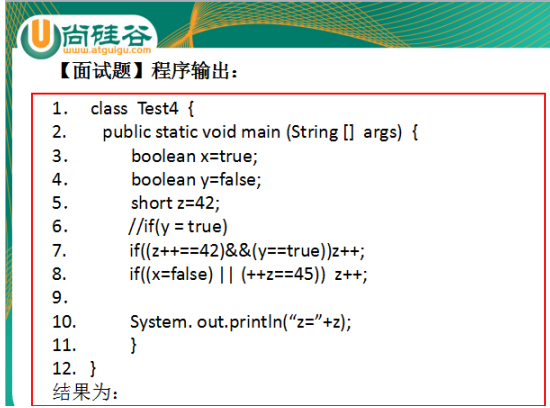

# JavaSE_第2章 Java基础语法

## 今日内容

- 数据类型
- 运算符

## 学习目标

-    [ ] 了解进制
-    [ ] 理解基本数据类型的自动类型转换
-    [ ] 理解基本数据类型的强制类型转换
-    [ ] 了解ASCII编码表和Unicode编码表
-    [ ] 理解int类型和char类型的运算原理
-    [ ] 理解运算符++ --的运算方式
-    [ ] 理解+符号在字符串中的作用
-    [ ] 掌握算术运算符
-    [ ] 掌握赋值运算符
-    [ ] 掌握比较运算符
-    [ ] 理解逻辑运算符
-    [ ] 掌握三元运算符的格式和计算结果
-    [ ] 了解位运算符
# 第二章 Java基础知识（续）

## 2.8  计算机如何存储数据

计算机世界中只有二进制。那么在计算机中存储和运算的所有数据都要转为二进制。包括数字、字符、图片、声音、视频等。

  

### 2.8.1 进制（了解）

 进制也就是进位计数制，是人为定义的带进位的计数方法 。

#### 1、进制的分类

（1）十进制：
数字组成：0-9
进位规则：逢十进一

（2）二进制：
数字组成：0-1
进位规则：逢二进一


十进制的256，二进制：100000000，为了缩短二进制的表示，又要贴近二进制，在程序中引入八进制和十六进制

（3）八进制：很少使用
数字组成：0-7
进位规则：逢八进一

与二进制换算规则：每三位二进制是一位八进制值

（4）十六进制
数字组成：0-9，a-f
进位规则：逢十六进一

与二进制换算规则：每四位二进制是一位十六进制值

#### 2、进制的换算

| 十进制 | 二进制 | 八进制 | 十六进制 |
| ------ | ------ | ------ | -------- |
| 0      | 0      | 0      | 0        |
| 1      | 1      | 1      | 1        |
| 2      | 10     | 2      | 2        |
| 3      | 11     | 3      | 3        |
| 4      | 100    | 4      | 4        |
| 5      | 101    | 5      | 5        |
| 6      | 110    | 6      | 6        |
| 7      | 111    | 7      | 7        |
| 8      | 1000   | 10     | 8        |
| 9      | 1001   | 11     | 9        |
| 10     | 1010   | 12     | a或A     |
| 11     | 1011   | 13     | b或B     |
| 12     | 1100   | 14     | c或C     |
| 13     | 1101   | 15     | d或D     |
| 14     | 1110   | 16     | e或E     |
| 15     | 1111   | 17     | f或F     |
| 16     | 10000  | 20     | 10       |

- **十进制数据转成二进制数据：**使用除以2倒取余数的方式
  

- **二进制数据转成十进制数据：**

  从右边开始依次是2的0次，2的1次，2的2次。。。。

  

- 二进制数据转八进制数据

  ​	从右边开始，三位一组

  

- 二进制数据转十六进制数据

  ​	从右边开始，四位一组
  
  

#### 3、在代码中如何表示四种进制的值

请分别用四种类型的进制来表示10，并输出它的结果：（了解）

（1）十进制：正常表示

System.out.println(10);

（2）二进制：0b或0B开头

System.out.println(0B10);

（3）八进制：0开头 

System.out.println(010);

（4）十六进制：0x或0X开头

System.out.println(0X10);

### 2.8.2 计算机存储单位


- **字节（Byte）：**是计算机信息技术用于计量存储容量的一种计量单位，一字节等于八位。

- **位（bit）：**是数据存储的最小单位。也就是二进制。二进制数系统中，每个0或1就是一个位，叫做bit（比特），其中8 bit 就称为一个字节(Byte)。

- **转换关系：**
  - 8 bit = 1 Byte
  - 1024 Byte = 1 KB
  - 1024 KB = 1 MB
  - 1024 MB = 1 GB
  - 1024 GB = 1 TB

### 2.8.3 Java的基本数据类型的存储范围

#### 1、整型系列

（1）byte：字节类型

* 占内存：1个字节

* 存储范围：-128~127


（2）short：短整型类型

* 占内存：2个字节

* 存储范围：-32768~32767


（3）int：整型

* 占内存：4个字节

* 存储范围：-2的31次方 ~ 2的31次方-1

（4）long：整型

* 占内存：8个字节

* 存储范围：-2的63次方 ~ 2的63次方-1


> 注意：如果要表示某个超过int范围的常量整数它是long类型，那么需要在数字后面加L

#### 2、浮点型系列（小数）

（1）float：单精度浮点型

* 占内存：4个字节

* 精度：科学记数法的小数点后6~7位


> 注意：如果要表示某个常量小数是float类型，那么需要在数字后面加F或f，否则就是double类型

（2）double：双精度浮点型

* 占内存：8个字节

* 精度：科学记数法的小数点后15~16位

```java
float f = 12.0F;//右边如果赋值小数常量值，那么必须加F或f
```

#### 3、单字符类型：char

* 占内存：2个字节

#### 4、布尔类型

boolean：只能存储true或false

> 虽然计算机底层使用0和1表示false和true，但是在代码中不能给boolean类型的变量赋值0和1，只能赋值false和true

### 2.8.4 计算机如何存储数据

#### 1、补码与符号位

*计算机数据的存储使用二进制补码形式存储，并且最高位是符号位，1是负数，0是正数。*

*规定：正数的补码与反码、原码一样，称为三码合一；*

​	    *负数的补码与反码、原码不一样：*

​	   *负数的原码：把十进制转为二进制，然后最高位设置为1*

​	   *负数的反码：在原码的基础上，最高位不变，其余位取反（0变1,1变0）*

​	   *负数的补码：反码+1*

*例如：byte类型（1个字节，8位）*

*25 ==> 原码  0001 1001 ==> 反码  0001 1001 -->补码  0001 1001*

*-25 ==>原码  1001 1001 ==> 反码1110 0110 ==>补码 1110 0111*

底层是用加法代替减法：-128==》-127-1==》-127+(-1)

​				       -127- -1 ==> -127 + 1

#### 2、一个字节可以存储的数据范围是多少？

（1）无符号：不考虑正负数

（2）有符号 

1个字节：8位

0000 0001  ~  0111 111 ==> 1~127

1000 0001 ~ 1111 1111 ==> -127 ~ -1

0000 0000 ==>0

1000 0000 ==> -128（特殊规定）

#### 3、如何存储小数

* 为什么float（4个字节）比long（8个字节）的存储范围大？

* 为什么double（8个字节）比float（4个字节）精度范围大？
* 为什么float和double不精确

因为float、double底层也是二进制，先把小数转为二进制，然后把二进制表示为科学记数法，然后只保存：

①符号位②指数位③尾数位

> *详见《float型和double型数据的存储方式.docx》*


#### 4、如何存储字符

* Java中使用的字符集：Unicode字符集

##### 编码表

在计算机的内部都是二进制的0、1数据，如何让计算机可以直接识别人类文字的问题呢？就产生出了编码表的概念。**编码表** ：就是将人类的文字和一个十进制数进行对应起来组成一张表格。例如：

| 字符 | 数值 |
| :--: | :--: |
|  0   |  48  |
|  A   |  65  |
|  a   |  97  |

将所有的英文字母，数字，符号都和十进制进行了对应，因此产生了世界上第一张编码表ASCII（American Standard Code for Information Interchange 美国标准信息交换码）。

Unicode(统一码、万国码、单一码)是计算机科学领域里的一项业界标准，包括字符集、编码方案等。Unicode 是为了解决传统的字符编码方案的局限而产生的，它为每种语言中的每个字符设定了统一并且唯一的二进制编码，以满足跨语言、跨平台进行文本转换、处理的要求。

##### 字符常量的几种表示方式

（1）'一个字符'

例如：'A'，'0'，'尚'

（2）转义字符

```
\n：换行
\r：回车
\t：Tab键
\\：\
\"："
\'：'
\b：删除键Backspace

System.out.println('\\');
System.out.println("hello\tworld\njava");
```

（3）\u字符的Unicode编码值的十六进制型

例如：'\u5c1a'代表'尚'

```java
		char c = '\u5c1a';
		char c = '尚';
		String s = '尚';//错误的，哪怕是一个字符，也要使用双引号
		
		char c2 = '';//错误，单引号中有且只能有一个字符
		String s2 = "";//可以，双引号中可以没有其他字符，表示是空字符串
```

（4）直接给char类型变量赋值十进制的0~65535之间的Unicode编码值

例如：'尚' 的编码值是23578

​	         'a'的编码值是97

```java
char c1 = 23578;
System.out.println(c1);//尚

char c2 = 97;
System.out.println(c2);//a
```


## 2.9  基本数据类型转换（Conversion）

在Java程序中，不同的基本数据类型的值经常需要进行相互转换。Java语言所提供的**七种数值类型**之间可以相互转换，基本数据类型转换有两种转换方式：自动类型转换和强制类型转换。

#### 1、自动类型转换（隐式类型转换）

**自动转换**：

 * 将`取值范围小的类型`自动提升为`取值范围大的类型` 。

基本数据类型的转换规则

小结：通过上面案例我们可以得出数据类型的转换关系（取值范围从小到大），如图所示：


（1）当把存储范围小的值（常量值、变量的值、表达式计算的结果值）赋值给了存储范围大的变量时，

```java
int i = 'A';//char自动升级为int
double d = 10;//int自动升级为double

byte b = 127; //右边的整数常量值必须在-128~127范围内
//byte bigB = 130;//错误，右边的整数常量值超过byte范围
long num = 1234567; //右边的整数常量值如果在int范围呢，编译和运行都可以通过，这里涉及到数据类型转换
long bigNum = 12345678912L;//右边的整数常量值如果超过int范围，必须加L，否则编译不通过
```

（2）当存储范围小的数据类型与存储范围大的数据类型一起混合运算时，会按照其中最大的类型运算

```java
int i = 1;
byte b = 1;
double d = 1.0;

double sum = i + b + d;//混合运算，升级为double
```

（3）当byte,short,char数据类型进行算术运算时，按照int类型处理

```java
byte b1 = 1;
byte b2 = 2;
byte b3 = b1 + b2;//编译报错，b1 + b2自动升级为int

char c1 = '0';
char c2 = 'A';
System.out.println(c1 + c2);//113 
```

（4）boolean类型不参与

#### 2、强制类型转换（显示类型转换）

将`1.5` 赋值到`int` 类型变量会发生什么？产生编译失败，肯定无法赋值。

```java
int i = 3.14; // 错误
```

想要赋值成功，只有通过强制类型转换，将`double` 类型强制转换成`int` 类型才能赋值。

* **强制类型转换**：将`取值范围大的类型`强制转换成`取值范围小的类型`。

 比较而言，自动转换是Java自动执行的，而强制转换需要我们自己手动执行。

**转换格式：**

```java
数据类型 变量名 = （数据类型）被强转数据值；
```

（1）当把存储范围大的值（常量值、变量的值、表达式计算的结果值）赋值给了存储范围小的变量时，需要强制类型转换，提示：有风险，可能会损失精度或溢出

```java
int i = (int)3.14;//强制类型转换，损失精度

double d = 1.2;
int num = (int)d;//损失精度

int i = 200;
byte b = (byte)i;//溢出
```

（2）boolean类型不参与

（3）当某个值想要提升数据类型时，也可以使用强制类型转换

```java
int i = 1;
int j = 2;
double shang = (double)i/j;
```

提示：这个情况的强制类型转换是没有风险的。

#### 3、特殊的数据类型转换

1、任意数据类型的数据与String类型进行“+”运算时，结果一定是String类型

```java
System.out.println("" + 1 + 2);//12
```

2、但是String类型不能通过强制类型()转换，转为其他的类型

```java
String str = "123";
int num = (int)str;//错误的
int num = Integer.parseInt(str);//后面才能讲到，借助包装类的方法才能转
```

#### 4、练习

```java
1、练习题：判断如下代码是否编译通过，如果能，结果是多少？
short s1 = 12;
short s2 = 8;
short s3 = s1 + s2;

2、练习题：判断如下代码是否编译通过，如果能，结果是多少？
short s1 = 12;
short s2 = 8;
byte s3 = (byte)(s1 + s2);

3、练习题：判断如下代码是否编译通过，如果能，结果是多少？
char c1 = '0';
char c2 = '1';
char c3 = c1 + c2;

4、练习题：判断如下代码是否编译通过，如果能，结果是多少？
char c1 = '0';
char c2 = '1';
System.out.println(c1 + c2);

5、练习题：判断如下代码是否编译通过，如果能，结果是多少？
int i = 4;
long j = 120; //因为右边120默认是int类型，int的值赋值给long类型是可以的，会自动类型转换，但是要求这个int值不能超过int的存储范围，如果超过int的存储范围必须加L.
double d = 34;
float f = 1.2;//因为右边1.2默认是double类型，double的值是不能直接赋值给float的，要么加F要么使用强制类型转换。

System.out.println(i + j + d + f);//最后是double

6、练习题：判断如下代码是否编译通过，如果能，结果是多少？
int i = 1;
int j = 2;
double d = i/j;
System.out.println(d);
```

## 2.10 运算符（Operator）

* 表达式：用运算符连接起来的式子
* 运算符的分类：
  按照功能分：算术运算符、赋值运算符、比较运算符、逻辑运算、条件运算符...

|       分类       |                运算符                 |
| :--------------: | :-----------------------------------: |
|    算术运算符    |  `+`、`-`、`*`、`/`、`%`、`++`、`--`  |
|    赋值运算符    |  `=`、`+=`、`-=`、`*=`、`/=`、`%=`等  |
|    关系运算符    |   `>`、`>=`、`<`、`<=`、`==`、`!=`    |
|    逻辑运算符    |    `&`、`|`、`^`、`!`、`&&`、`||`     |
|    条件运算符    |     `(条件表达式)?结果1:结果2；`      |
| 位运算符（了解） | `&`、`|`、`~`、`^`、`<<`、`>>`、`>>>` |

* 按照操作数个数分：一元运算符（单目运算符）、二元运算符（双目运算符）、三元运算符 （三目运算符）

  一元运算符：操作数只有一个
  	例如：正号（+）  +a
  		  负号（-）  -a
  		  自增自减   ++i  i++
  		  逻辑非：   !true

  二元运算符：操作数有两个
  	例如：加法：a+b
  		  减法：a-b
  		  大于：a>b
  		  逻辑与：a&b
  三元运算符：条件 ? 结果1 ： 结果2

### 2.10.1 算术运算符

|  算术运算符   |            符号解释             |
| :-----------: | :-----------------------------: |
|      `+`      | 加法运算，字符串连接运算，正号  |
|      `-`      |         减法运算，负号          |
|      `*`      |            乘法运算             |
|      `/`      | 除法运算，整数/整数结果还是整数 |
|      `%`      | 求余运算，余数的符号只看被除数  |
| `++` 、  `--` |          自增自减运算           |

#### 1、加减乘除模

```java
public class OperatorDemo01 {
	public static void main(String[] args) {
		int a = 3;
		int b = 4;
		
		System.out.println(a + b);// 7
		System.out.println(a - b);// -1
		System.out.println(a * b);// 12
		System.out.println(a / b);// 计算机结果是0，为什么不是0.75呢？
		System.out.println(a % b);// 3
        
        System.out.println(5%2);//1
		System.out.println(5%-2);//1
		System.out.println(-5%2);//-1
		System.out.println(-5%-2);//-1		
		//商*除数 + 余数 = 被除数
		//5%-2  ==>商是-2，余数时1    (-2)*(-2)+1 = 5
		//-5%2  ==>商是-2，余数是-1   (-2)*2+(-1) = -4-1=-5
	}
}
```

####  2、“+”号的两种用法

* 第一种：对于`+`两边都是数值的话，`+`就是加法的意思
* 第二种：对于`+`两边至少有一边是字符串得话，`+`就是拼接的意思

```java
public class OperatorDemo02 {
	public static void main(String[] args) {
		// 字符串类型的变量基本使用
		// 数据类型 变量名称 = 数据值;
		String str1 = "Hello";
		System.out.println(str1); // Hello
		
		System.out.println("Hello" + "World"); // HelloWorld
		
		String str2 = "Java";
		// String + int --> String
		System.out.println(str2 + 520); // Java520
		// String + int + int
		// String		+ int
		// String
		System.out.println(str2 + 5 + 20); // Java520
	}
}
```

#### 3、自加自减运算

**理解：**`++`  **运算，变量自己的值加1**。反之，`--` 运算，变量自己的值减少1，用法与`++` 一致。

1、单独使用

* 变量在单独运算的时候，变量`前++`和变量`后++`，变量的是一样的；
* 变量`前++`   ：例如 `++a` 。
* 变量`后++`   ：例如 `a++` 。

```java
public class OperatorDemo3 {
	public static void main(String[] args) {
		// 定义一个int类型的变量a
		int a = 3;
		//++a;
		a++;
        // 无论是变量前++还是变量后++，结果都是4
		System.out.println(a);
	}
}
```

2、复合使用

* 和`其他变量放在一起使用`或者和`输出语句放在一起使用`，`前++`和`后++`就产生了不同。

- 变量`前++` ：变量先自身加1，然后再取值。
- 变量`后++` ：变量先取值，然后再自身加1。

```java
public class OperatorDemo03 {
	public static void main(String[] args) {
		// 其他变量放在一起使用
		int x = 3;
		//int y = ++x; // y的值是4，x的值是4，
		int y = x++; // y的值是3，x的值是4
		
		System.out.println(x);
		System.out.println(y);
		System.out.println("==========");
        
		// 和输出语句一起
		int z = 5;
		//System.out.println(++z);// 输出结果是6，z的值也是6
		System.out.println(z++);// 输出结果是5，z的值是6
		System.out.println(z);
        
        int a = 1;
        a = a++;//(1)先取a的值“1”放操作数栈(2)a再自增,a=2(3)再把操作数栈中的"1"赋值给a,a=1

        int i = 1;
        int j = i++ + ++i * i++;
        /*
        从左往右加载
        (1)先算i++
        ①取i的值“1”放操作数栈
        ②i再自增 i=2
        （2）再算++i
        ①i先自增 i=3
        ②再取i的值“3”放操作数栈
        （3）再算i++
        ①取i的值“3”放操作数栈
        ②i再自增 i=4
        （4）先算乘法
        用操作数栈中3 * 3 = 9，并把9压会操作数栈
        （5）再算求和
        用操作数栈中的 1 + 9 = 10
        （6）最后算赋值
        j = 10
        */
	} 
}
```

* 小结：
  * **++在前，先自加，后使用；**
  * **++在后，先使用，后自加。**

#### 4、练习

##### （1）获取一个四位数的个位，十位，百位，千位

```java
public class Test01 {
	public static void main (String [] args) {
		//1.定义一个四位数，例如1234
		int num = 1234;
        
		//2.通过运算操作求出个位，十位，百位，千位
		int ge = ？
		int shi = ？
		int bai = ？
		int qian = ？
		
		System.out.println(num + "这个四位数个位上的数字是：" + ge);
		System.out.println(num + "这个四位数十位上的数字是：" + shi);
		System.out.println(num + "这个四位数百位上的数字是：" + bai);
		System.out.println(num + "这个四位数千位上的数字是：" + qian);
	}
}
```

##### （2）自增自减练习

判断如下代码的运行结果

```java
	public static void main(String[] args){
		int i = 1;
		int j = i++;
		int k = i++ * ++j + ++i * j++;
		
		System.out.println("i = " + i);
		System.out.println("j = " + j);
		System.out.println("k = " + k);
	}
```

```java
	public static void main(String[] args){
		int i = 1;
		int j = i++;
		int k = i++ * ++j + --i * j--;
		
		System.out.println("i = " + i);
		System.out.println("j = " + j);
		System.out.println("k = " + k);
	}
```

```java
	public static void main(String[] args){
		int i = 1;
		int j = ++i + i++ * ++i + i++;
		
		System.out.println("i = " + i);
		System.out.println("j = " + j);
	}
```

```java
public static void main(String[] args){
	int i = 0;
	int result = ++i/--i;
	System.out.println("result="+result);
}
```


### 2.10.2 赋值运算符

注意：所有的赋值运算符的=左边一定是一个变量

| 赋值运算符 |                           符号解释                           |
| :--------: | :----------------------------------------------------------: |
|    `=`     |               将符号右边的值，赋值给左边的变量               |
|    `+=`    | 将符号**`左边的值`**和**`右边的值`**进行相加操作，最后将结果**`赋值给左边的变量`** |
|    `-=`    | 将符号**`左边的值`**和**`右边的值`**进行相减操作，最后将结果**`赋值给左边的变量`** |
|    `*=`    | 将符号**`左边的值`**和**`右边的值`**进行相乘操作，最后将结果**`赋值给左边的变量`** |
|    `/=`    | 将符号**`左边的值`**和**`右边的值`**进行相除操作，最后将结果**`赋值给左边的变量`** |
|    `%=`    | 将符号**`左边的值`**和**`右边的值`**进行取余操作，最后将结果**`赋值给左边的变量`** |

#### 1、基本赋值运算符课堂案例


```java
public class OperatorDemo04 {
	public static void main(String[] args) {
		int a = 3;
		int b = 4;
		a = a + b; 
		System.out.println(a); // 7
		System.out.println(b); // 4	
	}
}
```
#### 2、扩展赋值运算符课堂案例

```java
public class OperatorDemo04 {
	public static void main(String[] args) {
		int a = 3;
		int b = 4;
		b += a;// 相当于 b = b + a ; 
		System.out.println(a); // 3
		System.out.println(b); // 7	
		
		short s = 3;
		// s = s + 4; 代码编译报错，因为将int类型的结果赋值给short类型的变量s时，可能损失精度
		s += 4; // 代码没有报错
        //因为在得到int类型的结果后，JVM自动完成一步强制类型转换，将int类型强转成short
		System.out.println(s);
        
        int j = 1;
		j += ++j * j++;//相当于  j = j + (++j * j++);
		System.out.println(j);//5
	}
}
```

* 扩展赋值运算符在**将最后的结果赋值给左边的变量前，都做了一步强制类型转换**。

#### 3、练习

交换两个变量的值
int m = 1;
int n = 2;

```java
int m = 1;
int n = 2;
int temp = m;
m = n;
n = temp;
```


### 2.10.3 关系运算符/比较运算符

| 关系运算符 |                           符号解释                           |
| :--------: | :----------------------------------------------------------: |
|    `<`     |  比较符号左边的数据是否小于右边的数据，如果小于结果是true。  |
|    `>`     |  比较符号左边的数据是否大于右边的数据，如果大于结果是true。  |
|    `<=`    | 比较符号左边的数据是否小于或者等于右边的数据，如果大于结果是false。 |
|    `>=`    | 比较符号左边的数据是否大于或者等于右边的数据，如果小于结果是false。 |
|    `==`    |          比较符号两边数据是否相等，相等结果是true。          |
|   `！=`    |     不等于符号 ，如果符号两边的数据不相等，结果是true。      |

* 比较运算符，是两个数据之间进行比较的运算，运算结果一定是boolean值`true`或者`false` 。
* 其中>,<,>=,<=不支持boolean，String类型，==和!=支持boolean和String。

```java
public class OperatorDemo05 {
	public static void main(String[] args) {
		int a = 3;
		int b = 4;

		System.out.println(a < b); // true
		System.out.println(a > b); // false
		System.out.println(a <= b); // true
		System.out.println(a >= b); // false
		System.out.println(a == b); // false
		System.out.println(a != b); // true
	}
}
```
#### 练习：判断如下程序的运行结果

```java
public static void main(String[] args){
	int a = 1;
	int b = 2;
	int c = 0;
	boolean flag = false;
	if(flag=true){
		c = a++ + b;
	}

	if(flag=false){
		c = ++a - b;
	}
	System.out.println("a = " + a);
	System.out.println("b = " + b);
	System.out.println("c = " + c);
}	
```

### 2.10.4 逻辑运算符

* 逻辑运算符，是用来连接两个布尔类型结果的运算符（`!`除外），运算结果一定是boolean值`true`或者`false`

| 逻辑运算符 |   符号解释   |               符号特点               |
| :--------: | :----------: | :----------------------------------: |
|    `&`     |    与，且    |          有`false`则`false`          |
|    `|`     |      或      |           有`true`则`true`           |
|    `^`     |     异或     |     相同为`false`，不同为`true`      |
|    `!`     |      非      | 非`false`则`true`，非`true`则`false` |
|    `&&`    | 双与，短路与 |      左边为false，则右边就不看       |
|    `||`    | 双或，短路或 |       左边为true，则右边就不看       |

####　1、课堂案例

```java
public class OperatorDemo06 {
	public static void main(String[] args) {
		int a = 3;
		int b = 4;
		int c = 5;

		// & 与，且；有false则false
		System.out.println((a > b) & (a > c)); 
		System.out.println((a > b) & (a < c)); 
		System.out.println((a < b) & (a > c)); 
		System.out.println((a < b) & (a < c)); 
		System.out.println("===============");
		// | 或；有true则true
		System.out.println((a > b) | (a > c)); 
		System.out.println((a > b) | (a < c)); 
		System.out.println((a < b) | (a > c));
		System.out.println((a < b) | (a < c));
		System.out.println("===============");
		// ^ 异或；相同为false，不同为true
		System.out.println((a > b) ^ (a > c));
		System.out.println((a > b) ^ (a < c)); 
		System.out.println((a < b) ^ (a > c)); 
		System.out.println((a < b) ^ (a < c)); 
		System.out.println("===============");
		// ! 非；非false则true，非true则false
		System.out.println(!false);
		System.out.println(!true);
	}
}
```
####　 2、&&和&区别，||和|区别

* **`&&`和`&`**区别：
  * `&&`和`&`结果一样，`&&`有短路效果，左边为false，右边不执行；`&`左边无论是什么，右边都会执行。
* **`||`和`|`**区别：
  * `||`和`|`结果一样，`||`有短路效果，左边为true，右边不执行；`|`左边无论是什么，右边都会执行。

#### 3、面试题1


```java
public class LogicExer1{
	public static void main(String[] args){
		int x = 1;
		int y = 1;

		//x==2 ,x++  false  x = 2 左边为false
		//右边继续
		//++y  y==2  y=2  y==2成立  右边为true
		//false & true 结果false
		if(x++==2 & ++y==2){
			x =7;
		}
		System.out.println("x="+x+",y="+y);//x=2,y=2
	}
}
```

```java
public class LogicExer2{
	public static void main(String[] args){
		int x = 1,y = 1;

		//x==2,x++  左边条件为false，x=2
		//因为短路与，右边不算
		//false && ? 结果是false
		if(x++==2 && ++y==2){
			x =7;
		}
		System.out.println("x="+x+",y="+y);//x=2,y=1
	}
}
```

```java
public class LogicExer3{
	public static void main(String[] args){
		int x = 1,y = 1;

		//x==1,x++  左边为true，x=2
		//因为是逻辑与,右边继续  
		//++y, y==1  y=2 右边为false
		//条件true | false，最终为true
		if(x++==1 | ++y==1){
			x =7;
		}
		System.out.println("x="+x+",y="+y);//x=7,y=2
	}
}	
```

```java
public class LogicExer4{
	public static void main(String[] args){
		int x = 1,y = 1;

		//x==1,x++  左边为true，x=2
		//因为是短路或，左边为true，右边就不看了
		//整个条件为true
		if(x++==1 || ++y==1){
			x =7;
		}
		System.out.println("x="+x+",y="+y);//x=7,y=1

	}
}
```


#### 4、面试题2



```java
public class LogicExer5{
	public static void main (String []  args)  {
		boolean x = true;
		boolean y = false;
		short z = 42;
		
		//如果if((z++==42)&&(y==true))条件成立，执行z++，不成立，就不执行z++
		//左边的条件：z==42,z++  z==42成立,z++变成43
		//中间虽然是短路与，因为左边现在是true,右边还要看
		//右边 y==true   不成立
		//true && false 结果为false
		if((z++==42)&&(y==true))	z++;
	
		//左边为x=false,赋值  结果就为false
		//中间虽然为短路或，因为左边是false,右边继续看
		//++z,z==45  ++z变成44，z==45是否成立，不成立
		//false || false  结果为false
		if((x=false) || (++z==45))  z++;

		System. out.println("z="+z);//44
	}
}
```

```java
class  Test4_2  {
	public static void main (String []  args)  {
		boolean x = true;
		boolean y = false;
		short z = 42;
		
		//如果if(y=true)条件成立，接着判断if((z++==42)&&(y==true))	z++;	
		//如果不成立，if((z++==42)&&(y==true))	z++;	不看的
		/*
		if(y = true)
				
		if((z++==42)&&(y==true))	z++;	
		
		if((x=false) || (++z==45))  z++;
		*/
		
		//标准
		//y=true赋值，y就被修改为true,if(true)成立
		if(y=true){
			//左边：z==42,z++  成立,z变成43
			//&&短路与，不满足短路的情况，右边继续
			//y==true 成立
			//true && true，结果为true
			if((z++==42)&&(y==true)){
				//z++变成44
				z++;
			}
		}
		//左边：x=false不成立
		//中间虽然是短路或，但是没满足短路的情况，右边继续
		//++z,z==45  ++z变成45，z==45成立
		if((x=false) || (++z==45)){
			//z++，变成46
			z++;
		}
		System. out.println("z="+z);//46
	}
}
```

### 2.10.5 条件运算符

- 条件运算符格式：

```java
条件表达式？结果1：结果2
```

- 条件运算符计算方式：
  - 条件判断的结果是true，条件运算符整体结果为结果1，赋值给变量。
  - 判断条件的结果是false，条件运算符整体结果为结果2，赋值给变量。

```java
public static void main(String[] args) {
    int i = (1==2 ? 100 : 200);
    System.out.println(i);//200
    int j = (3<=4 ? 500 : 600);
    System.out.println(j);//500
}
```

#### 练习

1、声明三个整型的变量,a,b,c,要求找出最大值
2、声明一个整型的变量，判断它是正数还是负数，还是0


### 2.10.6运算符优先级


提示说明：

（1）表达式不要太复杂

（2）先算的使用()

大体的排序：算术->位-->比较-->逻辑-->三元-->赋值